# Wedding RSVP website

 This website has been created as a first portfolio for the Code Institute's Full Stack Software Development Course. Evan and Anna's website is a fictional website. Having experience in the hospitality and wedding industry over various roles the subject matter is of personal interest. 
 
Visit the live [website](https://aoifesmith.github.io/evanandanna/).
  

## Table of Contents
  * [UX and UI](#ux-and-ui)
    * [External User Goals](#external-user-goals)
    * [Owner Goals](#site-owner-goals)
    * [Potential features to include:](#potential-features-to-include)
    * [User Stories](#user-stories)
    * [Wireframes](#wireframes)
*  [Design](#design)
    * [Imagery](#imagery)
    * [Colour Scheme](#colour-scheme)
    * [Typography](#typography)
    * [Favicon](#favicon)
*  [Features](#features)
*  [Deployment](#deployment)
*  [Testing](#testing)
    * [Validator Testing](#validator-testing)
    *  [Bugs](#bugs)
    *  [Manual Testing](#manual-testing)
    *  [Accessibility](#accessibility)
*  [Credits](#credits)
    *  [Imagery](#imagery)
    * [Code](#code)
    *  [Acknowledgements](#acknowledgements)

## UX and UI

During the strategy development plane of UX design a number of areas were considered based around fulfilling the needs of the user. User stories were identified as well as owner objectives.

### External User Goals:

The site users have been invited to a wedding and want to RSVP attendance for couples numbers as well as find out details about the wedding day.

### Site Owner Goals:

The goal of the site is for site owners to:
1. Confirm guest attendance and food choice in advance of their wedding to save food costs.
2. Provide the couples story
3. Provide information about local amenities.
4. Request guests to get involved in the document their memories through social profiles to create a digital album of their journey.

### Potential features to include:

1. A timeline of events/locations
2. Couples story information
3. Images/video supporting the couples engagement & story
4. Form to submit attendance and food choice details
5. Contact and social information links to follow and share in couples journey.

### User Stories:

1. As a first time user, I want to intuitively navigate the site.

2. As a wedding guest, I want to respond to the couple's wedding invitation so that they can advise the venue of meal/seating numbers.

3. As a guest accepting the couple's wedding invitation, I'd like to learn about the event dates and times so that I may there on time.

4. As a guest attending the couple's wedding invitation, I'd like to learn the location specifics so that I may arrive at the correct venue.

5. As the wedding couple, we want to present guests with information we've gathered on area lodging and amenities so they don't have to waste time looking up information we've already found.

6. As the wedding couple, we'd like to compile meal preferences from confirmed guests to submit to the venue chef in order to save money on meals.

7. As the wedding couple, we want to introduce ourselves to any guests who are unfamiliar with our partners so that they can learn more about us and ‘break the ice' with topics of interest to discuss.

8. As the wedding couple, we want to provide social media links for guests to follow our journey through images and tag us in photos and memories taken along the way providing a hashtag.

9. As a user, I want to get in touch with the site owner.

### Wireframes:

Wireframes were originally hand sketched designs created to aid planning the website layout. These were then created using [balsamiq](https://balsamiq.com/). These include link references to other pages such as RSVP button on home page to the RSVP form page, navigation menu links etc. for user design clarity and quick navigation.

* Mobile, Tablet, and Desktop wireframes are all available [here.](docs/evanandanna-wireframes.pdf) with images to follow in the dropdown menu below.

 Wireframes  Layout Images

 # Design

   * ## Imagery
   Research was carried out on a number of free to use photography websites from Pixabay to Unsplash. The images that were finally confirmed for use were sourced from a few different photographers on Unsplash. The hero image of the engagement ring has a simple backdrop and brings focus to the ring in the image as well as the RSVP button which is an important feature to direct the user to the RSVP form page. As this is a fictitious site the images of the people were carefully selected to have as close of a likeness and resemblance to each other in order to create consistency and sale the story as being real. In order to amplify this consistency in the look and feel of the website the images were then altered using the same colouring presets on the image editing ios app Lightroom. The presets had a subtle pink tone added to all sourced images. The images were compressed using the site tinypng to help improve site loading time performance and prevent user delay wait times. When tinypng was not implemented images that were sent from the developers iPad through the mail app selected either the small or medium size selection keeping kbs sizes as low as possible without losing integrity of the image or pixilation issues.

  * ## Colour Scheme
    Inspiration for the colour scheme of typography, layout colours and content components of the site was taken from the images curated. The images were run through a number of different colour generators (Brandfolder, Coolors, Procreate) until finally settled upon. [Image Color Testing Report](docs/readme/testing/lighthouse/colours-generated-from-image.pdf) These were then tested for contrast ratios in order to ensure they would pass accessibility requirements. By ensuring this step was catered out the result would be to the benefit of those with visual impairments. Where it was deemed necessary to slightly alter the colour value to achieve higher accessibility ratio results amendments were then made. These were only done where the and integrity of the design was to be maintained. See [Color Contrast Test Report](docs/readme/design/Contrast-Colour-Checking-Tests.pdf) 

    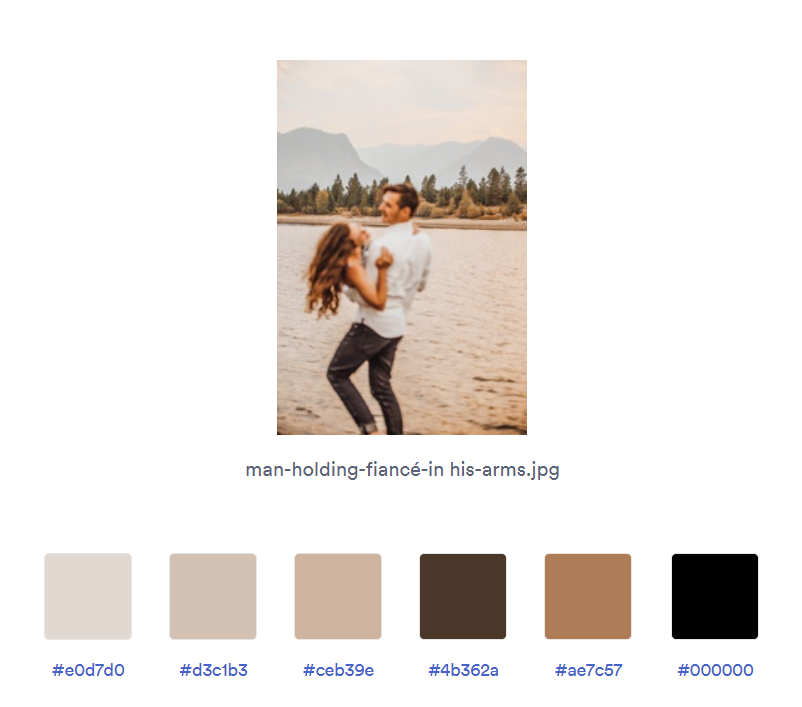
  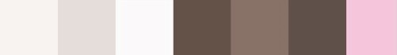
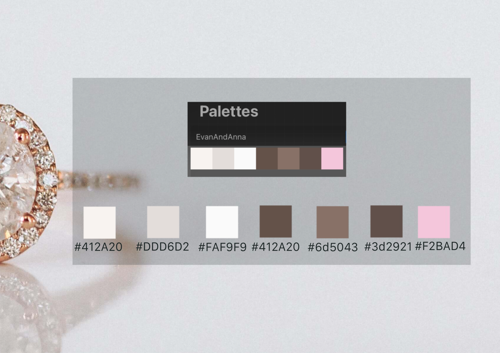

 * #f7f1ed – main background colour on all pages, rsvp button, timeline schedule text, form buttons
   #ddd6d2 – subtle variation of colour used to define the form area and draw attention to the feature.
 * #faf9f9 - social memories & accommodation list text (instances where a dark/brown background was used so not to lose the text as the main 
   text colour is brown)

 * #412A20 – brown – buttons, backgrounds to create emphasis or division of the site layout

 * #6d5043 – lighter brown – map border, buttons or headers where subtle variation/colour change to indicate interactive feature

 * #3d2921 – dark brown – social memories slightly darker brown to draw attention to the area.

 * #F2BAD4 – pink – Hashtag #F2BAD4 – pink – With a priority for the site owners to draw attention to the request to use their hashtag for collating images from guests it was decided to use a colour that stood out from the others and the pink colour was chosen. With the subtle pink tones of the pink presets used to make the images consistent this colour was deemed appropriate.

  * ## Typography

Research was carried out on a number of fonts for the website. A key factor of consideration was to keep accessibility in mind while still remaining true to the personality and likes of the website owner. The decision was to pursue minimal clean fonts to suit varying user guest’s needs from physical disability and impairments to aged effects. A number of tests and comparisons were carried out matching various suitable fonts and seeing how they looked compared against each other. The fonts were rotated to see what differences were when swapped from header to paragraph text. The final confirmed fonts Raleway and Roboto selected were both found on Google fonts. The appropriate weights and preferences were created for the style.css file. It was determined Roboto to be used for the headings and Raleway for the main text. A backup font of sans-serif would be used where these fonts were not available so the site would still remain relatively consistent.

Font Research & Comparisons

[Roboto Google Font - Headings Text](https://fonts.google.com/specimen/Roboto)
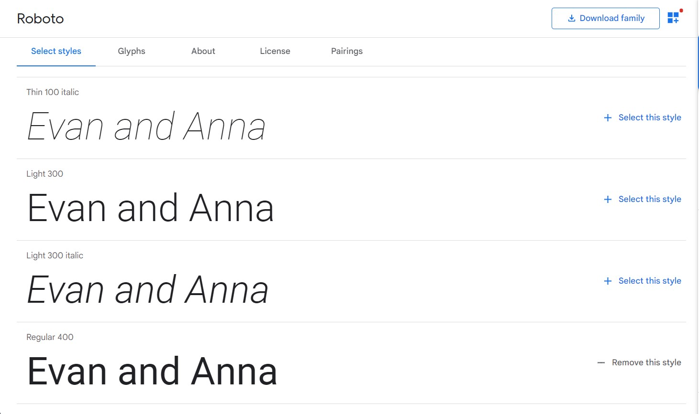

[Raleway Google Font - Main Content Text](https://fonts.google.com/specimen/Raleway)
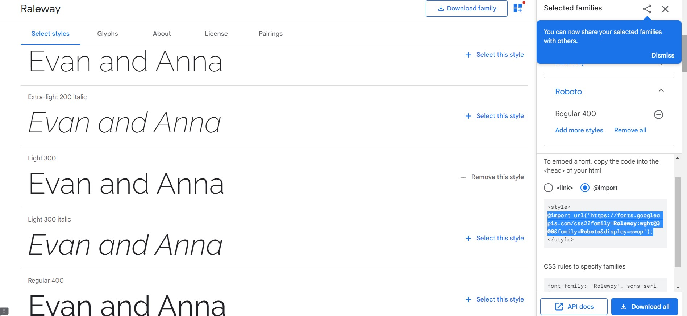

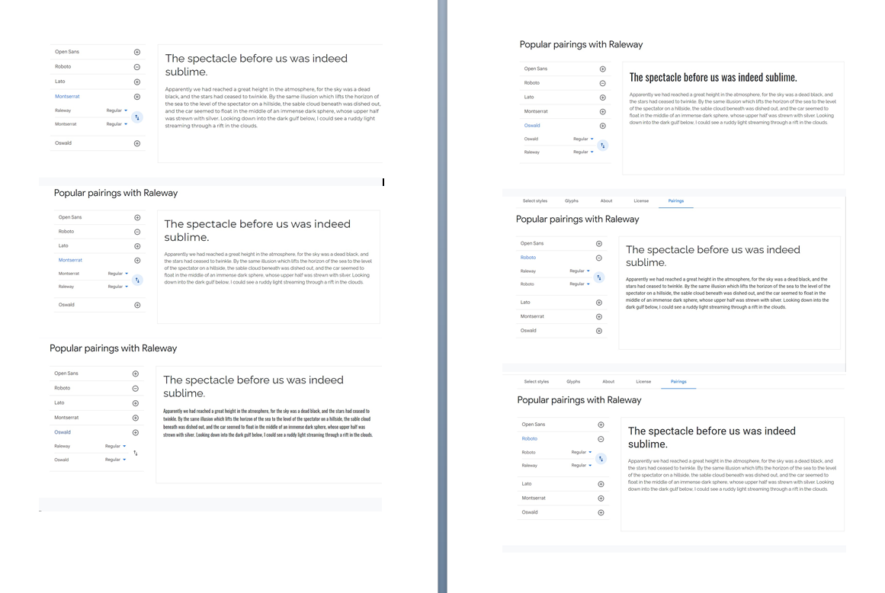

  * ## Favicon 

A favicon was created using the font Roboto similarily used for headers in the main site. The colour #412A20 which is the primary font colour was used. The background colour selected is the colour #f7f1ed as is that of the main website background colour. The text and colours were selected for consistency across the site. Can was taken to ensure the simple text ‘EA’ for the site owners names were scaled to the appropriate site so as no overflow/loss of text outside the size of the icon. The beneficial use of the favicon is it helps the user save time and quickly identify your website without difficulties where multiple tabs are open. It reiterates a goal of making the site intuitive for navigation both internally and externally when multiple tabs are open. It also reinforces the ‘brand’ of the website and gives a sense of confirmation that it is the right site.
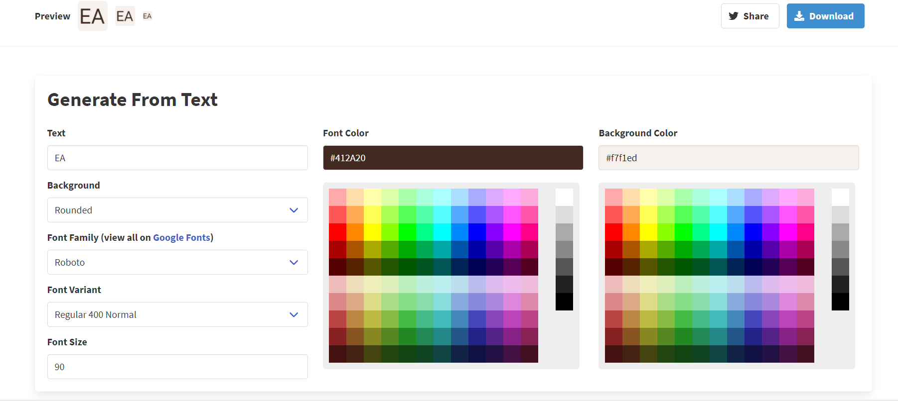

  #  Features

 ## All pages - Header and Footer sections:
 All pages have a header and footer. The header 

  * **Header** - The header contains the logo and the menu navigation links. This is located at the top of every page. When the user is viewing in mobile the header is a sticky feature and remains permanently visible at the top to avoid user fatigue should there be long pages of content.
 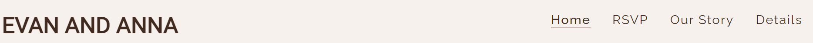

     * **Logo** - The logo is an interactive feature that returns the user to the home page. Simple design with the website owners names.
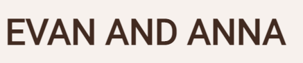

     * **Nav Bar** - The nav bar contains the links to the various pages on the website. They are structured to be on the top right hand corner of the browser on desktop and tablet whereas the float to the left in mobile. These are clickable links which when hovered over turn a darker shade to indicate they are links and can direct the user to the appropriate page selected. The nav link shows a line under the active page’s link to indicate to the user where they are on the site.
 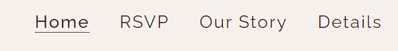

  * **Footer** - The footer exists on all pages. The footer consists of two items. The first is a box that requests the user to tag the couple using their hashtag in social media as a requirement of the site owners brief. The second part of the footer is for the social media icons. These direct the user to the social site which opens up in a new tab. The new tab is vital so the user can easily return to the website page they are on.
 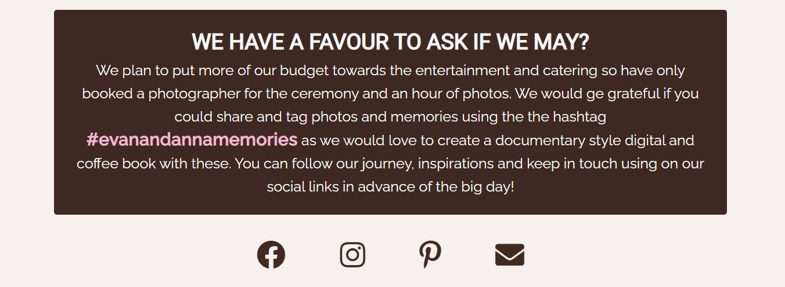
  
     * **Tag Memories Request** A brief paragraph of text is included in the footer whereby the wedding couple are requesting their guests tag them in social media using their custom hashtag. This is a priority of the site owners as a photography cost saving measure.

     * **Social icons** are incorporated in the centre of the footer section. These are appropriate for use on the site as they provide a means for the user to share tags and memories on site owner’s account benefiting photographer cost saving measures.

  * Note: The initial wireframes were designed to be responsive with a ‘hamburger’ icon hiding the navigation links for tablet and mobile. However after some coding issue and the design looking rather sparse in tablet form it was settled to be the same layout as the desktop. In mobile view the header was made permanent with the addition of a background so as not to be distracted by the moving scrolling content behind. Keeping the links ‘sticky’ at the top of the page scrolling fatigue for a mobile user who wants to utilise the menu to get to a different page. A go to ‘top’ button was considered but as this required JavaScript it was outside the scope of the developers learnings at the time.

 ## Homepage (index.html):

Apart from the header and footer the main homepage contains the hero image with interactive button, Our story section & schedule of events. 

  * **Hero image** and interactive rsvp button link to rsvp form (image is animated)
Content is made up of hero image with an animated zoom effect to draw attention to the **RSVP** button. This button includes the RSVP by date.

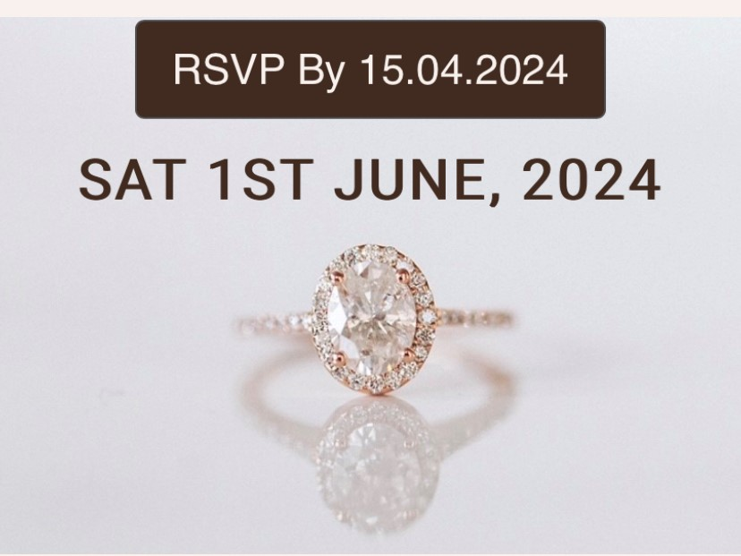

  * **Headings** Headings on the homepage are clickable links that direct the user to the appropriate page. There are subtle design colour and size of font changes when the user hovers over these heading links. 
  
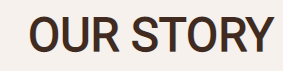
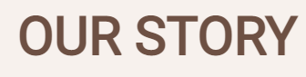

  * **Our Story** section is made up of a header with two columns that contain image and text. These columns change in layout with them being side by side or one on top of the other for mobile.

 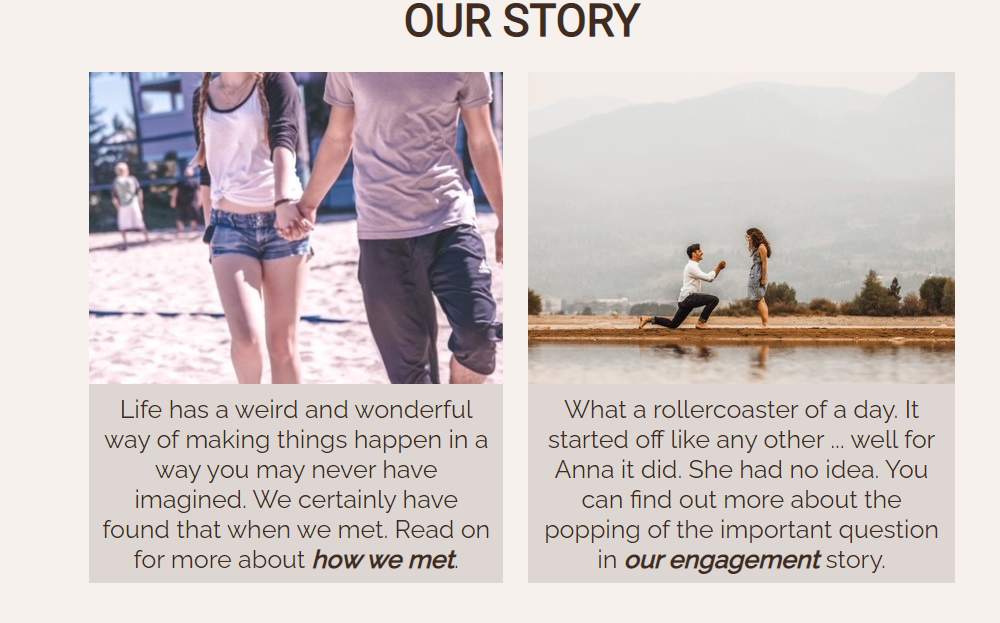

The 'Our Story' header is interactive and increases in size when hoovered over. This is a clickable link to direct the user to the Story page on the website. 
The **first column** contains an image and a paragraph of text about how the couple met with a read more link that takes the user to the full story on the Story page.  
The **second column** contains an image and a paragraph of text about the proposal with a read more link that takes the user to the full story on the Story page. 

  * The **Schedule of Events** section is made up of a header with three columns which are aligned either side by side in desktop mode or one on top of the other in tablet and mobile. These columns contain the event type, date and location on the venue grounds as well as an icon that represents the event type. A cocktail glass is displayed for the rehearsal dinner, a chapel building for the wedding and a hot dog icon for the casual brunch the day after the wedding. 

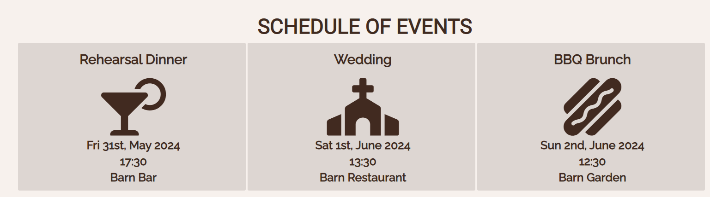

 ## RSVP page (rsvp.html):
  * The RSVP page's main functionality is to to present a form to the user to fill out and collect their RSVP response and food choices if attending the wedding. 
  * The **form** is designed with a subtle background colour to enhance the look of the form. 
  * A brief paragraph provides information to the user requesting they fill out the form. It provides information about the rsvp due date. It gives direction to the user on how to fill out the form. The information requested is the guests full name, attendance and meal choice. 
  * There are sections for 2 guests information to be filled out. Direction is provided that if the user is a solo guest to fill in 'n/a' to avoid issues with the submission process. 
  * The user input is a text input, selection from a drop down menu and also a radio button for the meal choice. An email address is requested. Finally there is an additional info message box for users that want to provide any specific information or requirements. 
  * A **submit button** is present at the bottom of the form. This submit button increases in size when hovered over. The user interacts with the button by clicking on it. 
  * Should any of the user input details not be filled out or done so incorrectly the user is directed to the input area to be filled in. 
  * Upon successful completion the user is directed to a 'Thank You' successful rsvp-response page.  

 ## RSVP Response page (rsvp-response.html):

  * The RSVP response page is comprises of a simple **'Thank You'** header and paragraph of thanks. It provides the user with successful acknowledgement for the submission of their RSVP. This provides comfort and to the user that they have correctly carried out the procedure and reinforces that they have finished with the process. 
   * A **Get In Touch** section is located just above the footer. It provides the user with a telephone number that the user can contact the couple on. This is an interactive feature that works on mobile devices and actions the phone app on their device if they click on the number link. A postal address is provided for users that want to communicate with the couple via mail. 
 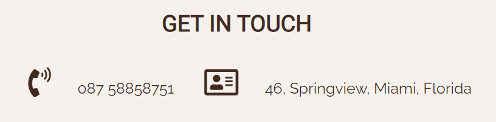

 ## Our Story page (story.html):

The Our Story page is made up of an 'About Us' section, 'How we met' and 'The Engagement story'

  * The Our Story pages begins with an **'About Us'** Section which is made up of an portrait image of the couple when they were young. A brief paragraph is supplied to provide background information about the couple. It is an important feature as the couple do not know every guest personally and vice-versa so this gives some interests or points for introduction. On large screen devices this section is split into 4 columns and 1 row. On mobile it is  2 columns and 2 rows and on mobile it is 1 column with for rows. 

  * In the **'How We Met'** section the user is presented with an image of the couple in their teens with a paragraph of text telling the couples story. 
  
  * To tell the story of **The Engagement** a brief video is provided along with text to follow below. 
  * The Engagement video is embedded by way of iFrame which links to a YouTube video. The video comprises of a number of the curated images. It contains title text to further tell the story. Audio in the form of a lighthearted song is played when the video has been interacted with and started. The video is used to provide visual credibility of the engagement story text that follows below it. In case of unsupported browser issues a link to the YouTube video is provided below. The video supports the story of the couples engagements.

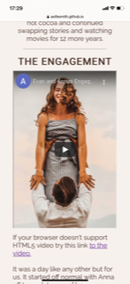

  * The story of the engagement proposal is provided in written context for the user to read. It is made up of 2 paragrpagh of text. 

 ## Details page (details.html):
The details page is split up into different content beginning with an introductory paragraph, interactive map, schedule of events repeated from the home page, list of accommodation, FAQs and a section providing information on how to get in touch. 
 
  * **Introductory opening paragraph** advising guests about the purpose of the page and its contents. It provides the user with the information they would need to know about the event times, location and FAQs. 

  * An **interactive Google map** is provided for the user which indicates the location of the event. As all activities occur in the one area they have the main information. However for those that want to venture or learn more having this map is a great starting point for those not familiar with the area. 

 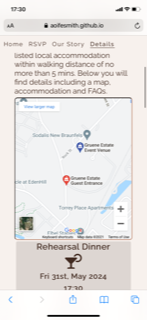

  * The **Schedule of Events** section is made up of three columns which are aligned either side by side in desktop mode or one on top of the other in tablet and mobile. These columns contain the event type, date and location on the venue grounds as well as an icon that represents the event type. A cocktail glass is displayed for the rehearsal dinner, a chapel building for the wedding and a hot dog icon for the casual brunch the day after the wedding. 

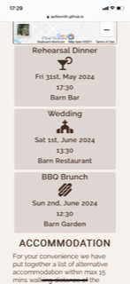

   * A **List of Accommodation** provides links to accommodation in the area. These are real accommodation listings in the area with the text being a link to their website. When the links are hovered over they change their font size and directs the user to the website in another tab. 
   * The **FAQs** section provides the user with general information about the wedding event and answer questions that may not have been addressed on the invitation. These include RSVP deadline, if kids are welcome, parking and more. If the user still has want to for information they are provided with directive to contact the couple using the contact information or social media links below. 
   * A **Get In Touch** section is located just above the footer. It provides the user with a telephone number that the user can contact the couple on. This is an interactive feature that works on mobile devices and actions the phone app on their device if they click on the number link. A postal address is provided for users that want to communicate with the couple via mail. 

 ## 404 Error page (404.html):

  * In order to maintain consistency on the site a an error 404 page was created. This page is called upon when a user enters the wrong address and the address bar. Within the page there is appropriate direction and recommendations to utilise the navigation bar at the top to return to a valid page on the site. Alternatively the user is advised they can make contact with the site owner using the contact or social media links also provided on that page.

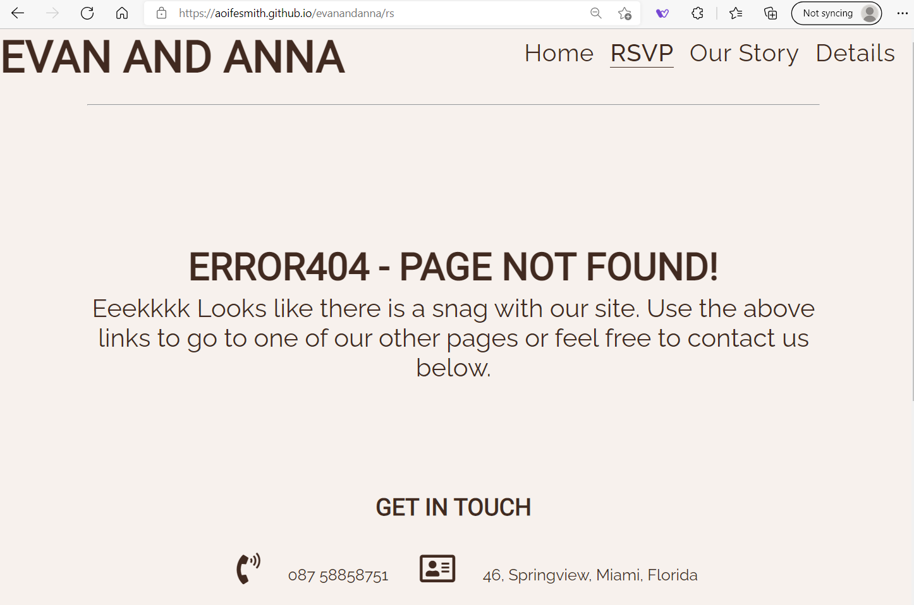

 ## Future implementations:

  * Add information about the bridal party and groomsmen providing brief synopsis and possible contact details.
  * Features to implement in future

  * Add a gallery of the curated memories

  * Add posts of additional events along the course of the engagement.

  * Hen and stag party, cake tasting, meal tasting, sneak peak of the decor,

  * The above features were considered during the initial development stage but were considered lower priorities or deemed not relevant until the couple would be further along their journey where they will have the content.

# Technologies Used

   * ## Languages

 * [HTML5](https://en.wikipedia.org/wiki/HTML5)

 *  [CSS](https://en.wikipedia.org/wiki/CSS)

   * ## Frameworks and Libraries
  *  [Unsplash](https://unsplash.com/)
  *  [Coolors.co](https://coolors.co)
 * [Balsamiq](https://balsamiq.com/)
 *  [Brandfolder](https://brandfolder.com/workbench/color-palette)
 *  [Google Fonts](https://fonts.google.com/)
 *  [Font Awesome](https://fontawesome.com/)
 *  [VS Code](https://code.visualstudio.com/)
 *  [GitHub](https://github.com/)
 *  [Am I Responsive](http://ami.responsivedesign.is/)
 *  [Favicon.io](https://favicon.io)
 *  [Splice](https://apps.apple.com/us/app/splice-video-editor-maker/id409838725)
 *  [YouTube](https://youtube.com)
 *  [StackEdit](https://stackedit.io/)
 *  [WeTransfer](https://wetransfer.com/)
 *  [Slack](https://slack.com/)
 *  [Tinypng](https://tinypng.com/)
 *  [Inspect Browser iOS app](https://pdyn.net)
 *  [Chrome Dev Tools](https://developer.chrome.com/docs/devtools/)
 *  [GitHub Mobile](https://github.com/mobile)
 *  [Procreate](https://apps.apple.com/us/app/procreate/id425073498)
 * [Trello- Project management](https://trello.com) Throughout the all stages the project management app Trello was utilized. It aided in organising to do checklists, set reminders, organising images and documentation as well as an area to place ideas. Lists were created for Planning, Content, Git & To do Code checklists, Mentor, Readme.md, Accessibility and Testing. These lists contained cards for note taking, research, scheduling mentor meetings, collation of admin, testing with checklists and screenshots of results. Files were added to cards such as images sourced or other relevant documentation. Some cards were set up with due dates which were connected to the developer’s email if getting close to deadline a reminder was sent. The management app was helpful to keep on track and focus on prioritized items within the project.

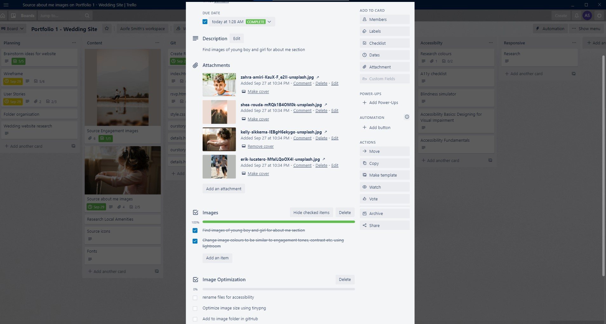
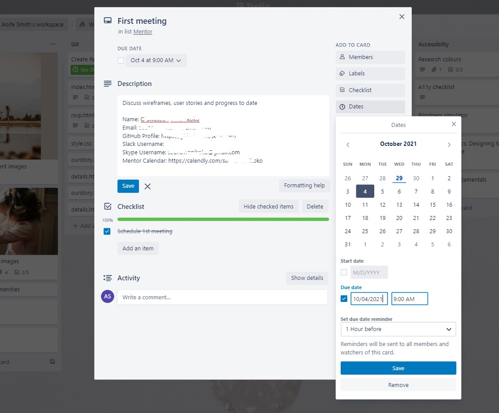
  

# Deployment

This project was created using Gitpod. On occasion when there were server site issues with Gitpod VS code was used to progress and code was copied and pasted to the project on Gitpod. The site was deployed to Github pages.

i. On GitHub, navigate to your repositories.

ii. Select the site.

iii. Navigate to *Settings*.

iv. In the left sidebar, select Pages.

v. Under the GitHub Pages from the source section drop-down menu, select the main branch.

vi. Upon correct selection and saving of the main branch, refresh the page and the site is successfully deployed.

vii, The site is published with the live site address provided.

# Testing

*  ## Validator Testing

Validator testing was carried out on all pages on the site using [W3C HTML Validator](https://validator.w3.org) for html and [Jigsaw](https://jigsaw.w3.org/css-validator/) for CSS. See [Full Testing results Report](docs/readme/testing/htmlcss-validator/ALLHTMLCSSValidator-NoErrors.pdf)

* There were no errors or warnings for all html pages where code was directly input.

* There were no errors or warnings when for CSS deployed site was input.

* There were no errors for CSS but a warning when code was directly input.

*  ## Bugs

During the course of the project validation of html pages was carried out.

* The rsvp page’s form submit button was not returning the response-rsvp page. The method was missing so added this and working properly.
  

  
RSVP Button Link

  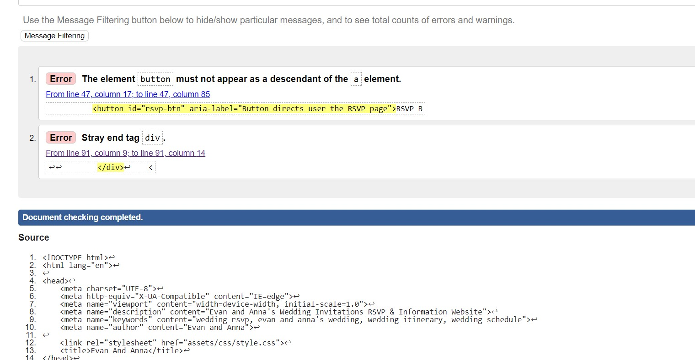
  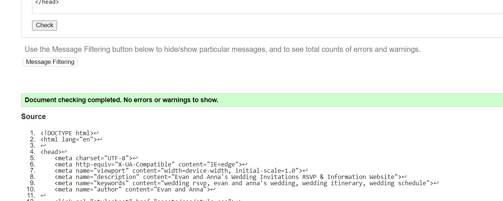
  

 
* A Stray Div Error was noted as a result of html validation test. The stray div was located and removed with success:
  

  
Stray Div

  
  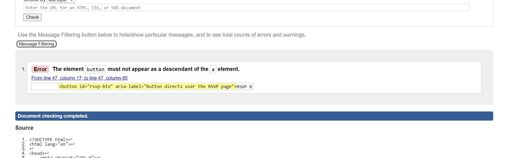 

* The HTML validator returned an error with the form label on the RSVP form page. The issue was incorrect value assigned. This was amended and resolved the issue.
  

  
Form Label Not Assigned Correctly

  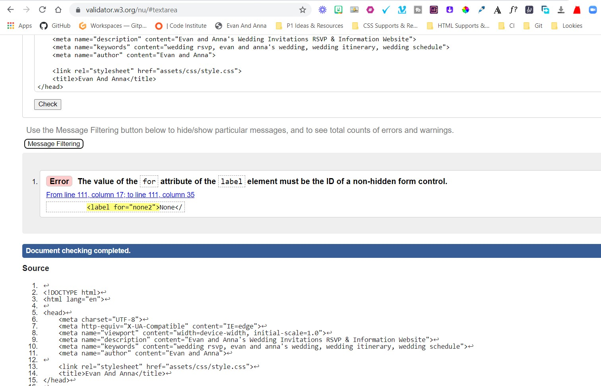
  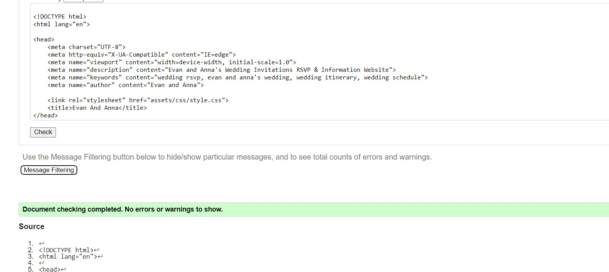

* Image skew issue for the about images on the main home page Our story section. The styling code was amended and issue was resolved.
  

  
Image Skewed

  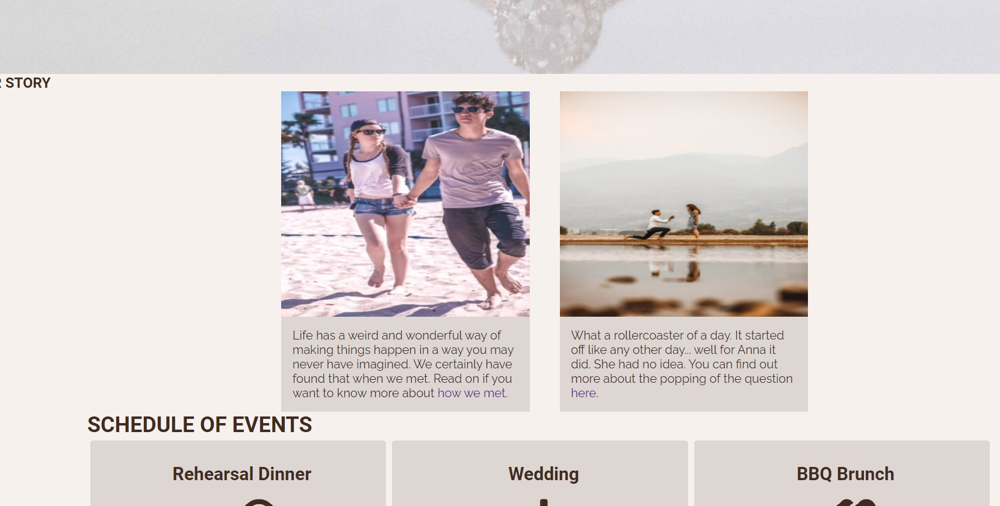

* Header Sticky 1 -It was decided during the course of the project to make the header with the logo and navigation links a sticky feature for smaller mobile devices. An issue to overcome was to ensure the content in the background that was scrolling behind the nav bar would not be visible behind the header as this would cause distraction. A plain background colour was added. During the process it was noted that the background colour was not showing. A number of attempts and efforts were made including assigning the background colour to the nav-links and the logo but this was not as visually appealing.
  

  
Background Colour Header Initial Resolve

  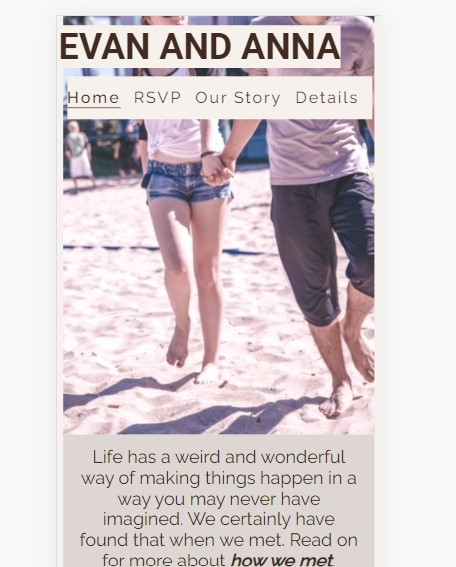

  

* Header sticky 2- Upon further research the bug was as a result of no height having being assigned in the header. The height was assigned and the issue was resolved with a more defined header area.
  

  
Header Background Resolve

  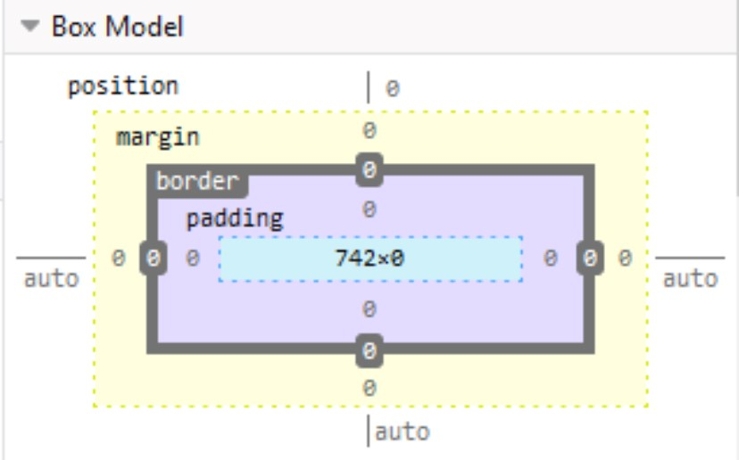
  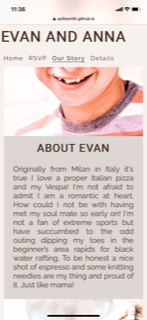

* Web browser styling issue: Firefox – Style issue for story page –about images and text overflow issue on top of page. This did not appear to be an issue on Edge, Chrome, Safari or Brave. Unfortunately these were left unresolved due to time constraints.
  

  
Web browser styling issue: Firefox

  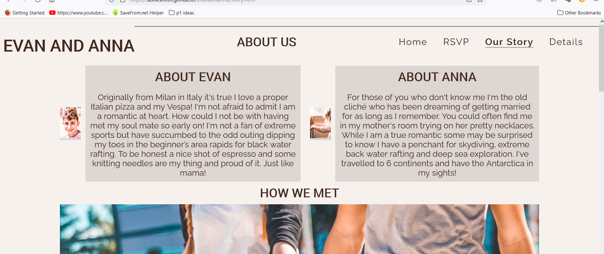
  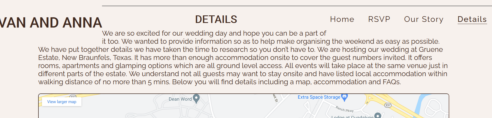

 * ## Manual Testing:
 The site was tested manually such as checking links, features were working, interactivity was successful. Features included testing if email apps would correctly open upon interacting with the email social link. Testing to see if the telephone contact number would successfully work when the link was interacted with proved successful. All the sites pages were tested and efforts were made to test on multiple browsers include Safari, Edge, Chrome, Brave and Firefox. Devices tested on were iPad, iPhone and Windows 10 Laptop.  Where the devices were not readily available the Chrome Web Development Tools were utilized. See nore in the 
[Features Testing Report 1](docs/readme/testing/FeaturesTesting1.pdf).

   

  
Email & Telephone Success

  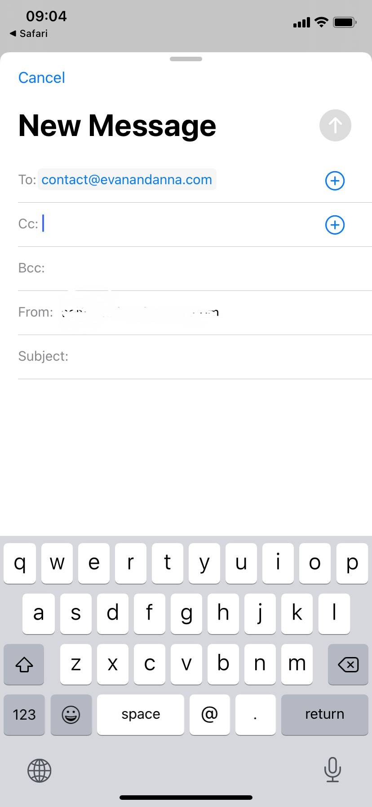
  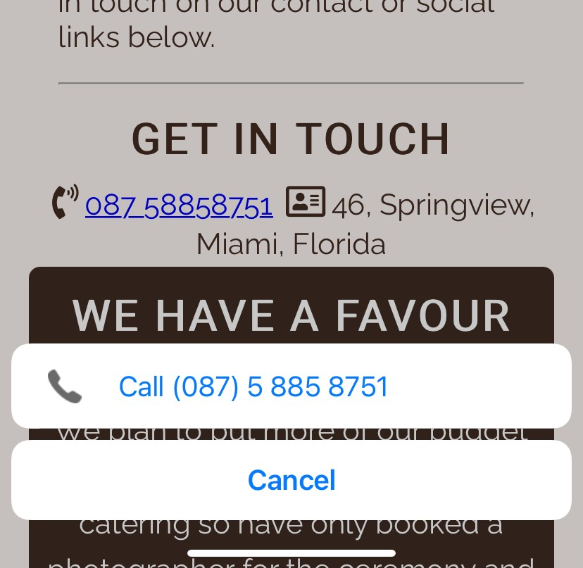

 
 

  * ## Accessibility:

Accessibility was researched in order to explore best practice for design based around accessibility including colour contract and better user experiences.

* [The Accessibility Guide for Building a Better User Experience](https://blush.design/blog/post/accessibility-user-experience)
* [How to pick colors for your design (A little lesson in contrast)](https://www.youtube.com/watch?v=b-PqO-ILcYo)
* [Blindness Simulator]( https://www.colorhexa.com/ff0000#blindness-simulator)
* [Text elements must have sufficient color contrast against the background](https://dequeuniversity.com/rules/axe/3.5/color-contrast)
* Clear and simple font selection and letter spacing was implemented to enhance the user experienced.
* Aria labelling was implemented on all pages.
* Results from Lighthouse testing deemed accessibility to be sufficient.

# Credits

  *   ## Images & Media

*  [Unsplash](https://unsplash.com)

*  [Ring Image - Jenna Day](https://unsplash.com/@jennaday)

*  [Engagment Photos - Taylor Brandon](https://unsplash.com/@house_42)

*  [Couple on Bridge with Dog - Shea Rouda](https://unsplash.com/@shrouda)

*  [Teen Couple on Beach - Erik Lucatero](https://unsplash.com/@erik_lucatero)

*  [Young Boy - Zahra Amiri](https://unsplash.com/@zahraamiri)

*  [Young Girl with Beads - Kelly Sikkema](https://unsplash.com/@kellysikkema)

*  [Icons - Font Awesome](https://fontawesome.com/)

*  [Splice - Audio](https://apps.apple.com/us/app/splice-video-editor-maker/id409838725) Custom created video using above credited photographers images. Audio included in Splice editor.

*  [Audio - A Beautiful Day - Wolf Samuels](https://apps.apple.com/us/app/splice-video-editor-maker/id409838725)

*  ## Content

* All text content on the site is my own. Stories and details are all fictitious creations. The wedding venue is a real location although the amenities do not contain all features. Location is real. The accommodation are real and within close proximity to the venue. Appropriate links to their websites are used.

*  ## Code 

* Multiple sites were researched with inspiration taken from many.

* References were taken from the [Love Running](https://github.com/Code-Institute-Solutions/love-running-2.0-sourcecode/tree/main/03-creating-the-hero-image/03-hero-image-cover-text) Code Institute project where these were edited to suit the needs of the website. This included the animated zoom image feature as well as the the events timeline.

*  [Easy Card Design Layout with CSS Grid](https://codepen.io/dcode-software/pen/JjjpzLE) Made use of this code for the about us section in the main homepage. 

* The addition of the forcing the footer to the bottom was implemented as a result of a recommendation of Matt_Boden_5P_Lead in the slack community after carrying out a peer review. Code to aid with this came from the article 'Keeping the footer at the bottom with CSS Flexbox' by [Dominik Weber](https://dev.to/domysee)

*  [W3C](www.w3schools.com) provided fantastic references for solutions to problems and bugs within the code along the way.

*  ## Acknowledgements

* Mentor Seun for reassurances and helpful guidance on meetings.

* The incredible CI community & fellow students in the 17th-Aug-Start-Team channel (with particular mention to FabioMadeira_5P & David Kelleher) who provided pointers, fresh eyes and vital mental and educational support along the way. The list is plentiful on CI Slack but not limited to Sven Lowry_5P & David_Bowers. 

* A number of readme files were researched for ideas on structure of file and topics to address.  In particular the structure and layout that was used for inspiration from # [MaggieWalsh](https://github.com/MaggieWalsh)'s readme.

* Matt_Boden_5P_Lead for taking time to review my site in the Peer review code channel on slack and making recommendations for improvements. Where possible to implement these were taken on board and carried out.