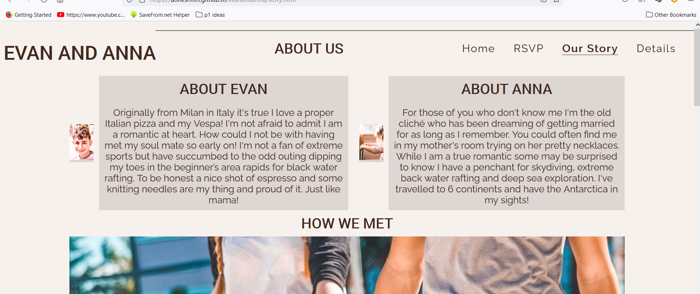

# Wedding RSVP website

This website has been created as a first portfolio for the Code Institute's Full Stack Software Development Course. Evan and Anna's website is a fictional website. 

Visit the live [website](https://aoifesmith.github.io/evanandanna/). 

## Table of Contents
  * [UX and UI](#ux-and-ui)
    * [External User Goals](#external-user-goals)
    * [Owner Goals](#site-owner-goals)
    * [Potential features to include:](#potential-features-to-include)
    * [User Stories](#user-stories)
    * [Wireframes](#wireframes)
* [Design](#design)
* [Deployment](#deployment)
* [Testing](#testing)
    * [Validator Testing](#validator-testing)
    * [Bugs](#bugs)
* [Credits](#credits)
    * [Imagery](#imagery)
    * [Code](#code)
    * [Acknowledgements](#acknowledgements)

## UX and UI

During the strategy development plane of UX design a number of areas were considered based around fulfilling the needs of the user. User stories were identified as well as owner objectives.

### External User Goals:
The site users have been invited to a wedding and want to RSVP attendance for couples numbers as well as find out details about the wedding day. 

### Site Owner Goals:
The goal of the site is for site owners to:
Confirm guest attendance and food choice in advance of their wedding to save food costs.
Provide the couples story
Provide information about local amenities. 
Request guests to get involved in the document their memories through social profiles to create a digital album of their journey.

### Potential features to include:
A timeline of events/locations
Couples story information
Images/video supporting the couples engagement & story
Form to submit attendance and food choice details
Contact and social information links to follow and share in couples journey.

### User Stories:

 1. As a first time user, I want to intuitively navigate the site.
 2. As a wedding guest, I want to respond to the couple's wedding invitation so that they can advise the venue of meal/seating numbers.
 3. As a guest accepting the couple's wedding invitation, I'd like to learn about the event dates and times so that I may there on time.
 4. As a guest attending the couple's wedding invitation, I'd like to learn the location specifics so that I may arrive at the correct venue.
 5. As the wedding couple, we want to present guests with information we've gathered on area lodging and amenities so they don't have to waste time looking up information we've already found.
 6. As the wedding couple, we'd like to compile meal preferences from confirmed guests to submit to the venue chef in order to save money on meals.
 7. As the wedding couple, we want to introduce ourselves to any guests who are unfamiliar with our partners so that they can learn more about us and ‘break the ice' with topics of interest to discuss.
 8. As the wedding couple, we want to provide social media links for guests to follow our journey through images and tag us in photos and memories taken along the way providing a hashtag.
 9. As a user, I want to get in touch with the site owner.
   
### Wireframes:
   Wireframes were originally hand sketched designs created to aid planning the website layout. These were then created using [balsamiq](https://balsamiq.com/). These include link references to other pages such as RSVP button on home page to the RSVP form page, navigation menu links etc. for user design clarity and quick navigation. 
    * Mobile, Tablet, and Desktop wireframes are all available [here.](docs/evanandanna-wireframes.pdf)
  

 
   
    
    
      

 * ## Design

 Color Palette 

  * ## Technologies Used
    * ## Languages
      * [HTML5](https://en.wikipedia.org/wiki/HTML5)
      * [CSS](https://en.wikipedia.org/wiki/CSS)
   
    * ## Frameworks and Libraries
      * [Balsamiq](https://balsamiq.com/)
      * [Unsplash](https://unsplash.com/)
      * [Coolors.co](https://coolors.co)
	  * [Brandfolder](https://brandfolder.com/workbench/color-palette)
      * [Google Fonts](https://fonts.google.com/)
      * [Font Awesome](https://fontawesome.com/)      
      * [VS Code](https://code.visualstudio.com/)
      * [GitHub](https://github.com/)
      * [Am I Responsive](http://ami.responsivedesign.is/)
      * [Favicon.io](https://favicon.io)
      *  [Splice](https://apps.apple.com/us/app/splice-video-editor-maker/id409838725)
      * [YouTube](https://youtube.com)
      * [StackEdit](https://stackedit.io/)
      * [WeTransfer](https://wetransfer.com/)
      *  [Slack](https://slack.com/)  
      * [Tinypng](https://tinypng.com/)  
      * [Inspect Browser iOS app](https://pdyn.net)
      * [Chrome Dev Tools](https://developer.chrome.com/docs/devtools/)
      * [GitHub Mobile](https://github.com/mobile)
      * [Procreate](https://apps.apple.com/us/app/procreate/id425073498)  

  * ## Deployment

     This project was created using Gitpod. On occasion when there were server site issues with Gitpod VS code was used to progress and code was copied and pasted to the project on Gitpod. The site was deployed to Github pages.
  
      i. On GitHub, navigate to your repositories.
      ii. Select the site. 
      iii. Navigate to  *Settings*.
      iv. In the left sidebar, select Pages.
      v. Under the GitHub Pages from the source section drop-down menu, select the main branch.
      vi. Upon correct selection and saving of the main branch, refresh the page and the site is successfully deployed.
      vii, The site is published with the live site address provided.

  * ## Testing
      * ## Validator Testing

Validator testing was carried out on all pages on the site using [W3C HTML Validator](https://validator.w3.org) for html and [Jigsaw](https://jigsaw.w3.org/css-validator/) for CSS. See [Full Testing results Report](docs/readme/testing/htmlcss-validator/ALLHTMLCSSValidator-NoErrors.pdf) 

* There were no errors or warnings for all html pages where code was directly input.
* There were no errors or warnings when for CSS deployed site was input.
* There were no errors for CSS but a warning when code was directly input.
   * ## Bugs

  *The rsvp page’s form submit button was not returning the response-rsvp page. The method was missing so added this and working properly.

  

  

  During the course of the project validation of html pages was carried out.

  * There was an issue with the coding of the button and a href hierarchy.

  

  The code was amended with the corrected hierarchy and the issue was resolved:

  

  * A Stray Div Error was noted as a result of html validation test.

  

  The stray div was located and removed with success:

  

  * The validator returned an error with the form label on the RSVP form page. The issue was incorrect value assigned. This was amended and resolved the issue.

  

  

  * Image skew issue for the about images on the main home page Our story section. The styling code was amended and issue was resolved.

  ![Image Skew Our Story Homepage] (docs/testing/bugs/image skew-object fit.jpg)

  * Header sticky

  It was decided to make the header with the logo and navigation links a sticky feature for smaller mobile devices. An issue to overcome was to ensure the content in the background that was scrolling behind the nav bar would not be transparent as this would cause distraction. A plain background colour was added. During the process it was noted that the background colour was not showing. A number of attempts and efforts were made including assigning the background colour to the nav-links and the logo but this was not as visually appealing.

  

  Upon further research the bug was as a result of no height having being assigned in the header.

  The height was assigned and the issue was resolved with a more defined header area.

  

  * Web browser styling issue: Firefox – Style issue for story page –about images and text overflow issue on top of page. This did not appear to be an issue on Edge, Chrome, Safari or Brave. Unfortunately these were left unresolved due to time constraints.

  

  

 * ## Credits
   * ## Images & Media
        * [Unsplash](https://unsplash.com)
        * [Ring Image - Jenna Day](https://unsplash.com/@jennaday)
        * [Engagment Photos - Taylor Brandon](https://unsplash.com/@house_42)
        * [Couple on Bridge with Dog - Shea Rouda](https://unsplash.com/@shrouda)
        * [Teen Couple on Beach - Erik Lucatero](https://unsplash.com/@erik_lucatero)
        * [Young Boy - Zahra Amiri](https://unsplash.com/@zahraamiri)
        * [Young Girl with Beads - Kelly Sikkema](https://unsplash.com/@kellysikkema)
        * [Icons - Font Awesome](https://fontawesome.com/)
        * [Splice - Audio](https://apps.apple.com/us/app/splice-video-editor-maker/id409838725) Custom created video using above credited photographers images. Audio included in Splice editor.
        * [Audio - A Beautiful Day - Wolf Samuels](https://apps.apple.com/us/app/splice-video-editor-maker/id409838725)
      
   * ## Content
      * All text content is my own. Stories and details are all fictitious creations.  The wedding venue is a real location although the amenities do not contain all features. Location is real.  The accommodation are real and within close proximity to the venue. Appropriate links to their websites are used.
        
    * ## Code

      * Multiple sites were researched with inspiration taken from many. 
      * References were taken from the [Love Running](https://github.com/Code-Institute-Solutions/love-running-2.0-sourcecode/tree/main/03-creating-the-hero-image/03-hero-image-cover-text) Code Institute project where these were edited to suit the needs of the website. This included the animated zoom image feature as well as the the events timeline.  
      * [Easy Card Design Layout with CSS Grid](https://codepen.io/dcode-software/pen/JjjpzLE)
      * The addition of the forcing the footer to the bottom was implemented as a result of a recommendation of Matt_Boden_5P_Lead in the slack community after carrying out a peer review. Code to aid with this came from the article 'Keeping the footer at the bottom with CSS Flexbox' by [Dominik Weber](https://dev.to/domysee)
      * [W3C](www.w3schools.com) provided fantastic references for solutions to problems and bugs within the code along the way.
      
    * ## Acknowledgements
      * Mentor Seun for reassurances and helpful guidance on meetings. 
      * The incredible CI community & fellow students in the 17th-Aug-Start-Team channel who provided pointers, fresh eyes and vital mental and educational support along the way. The list is plentiful including but not limited to Sven Lowry_5P & David_Bowers. 
      * Matt_Boden_5P_Lead for taking time to review my site in the Peer review code channel on slack and making recommendations for improvements. Where possible to implement these were taken on board and carried out.