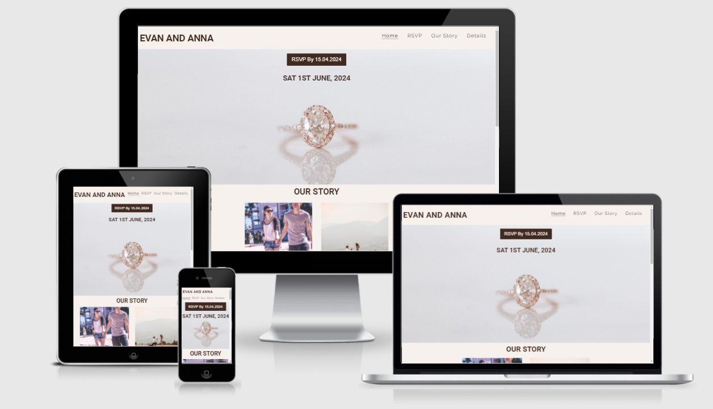
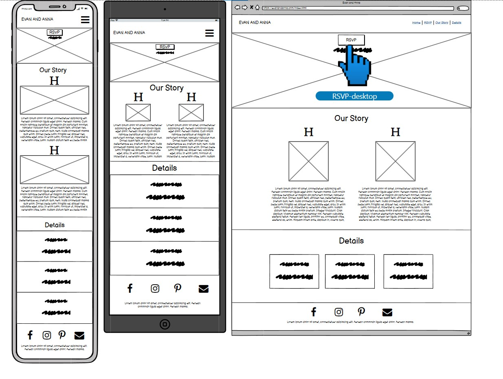
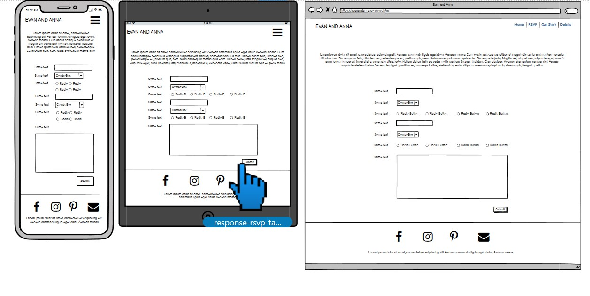
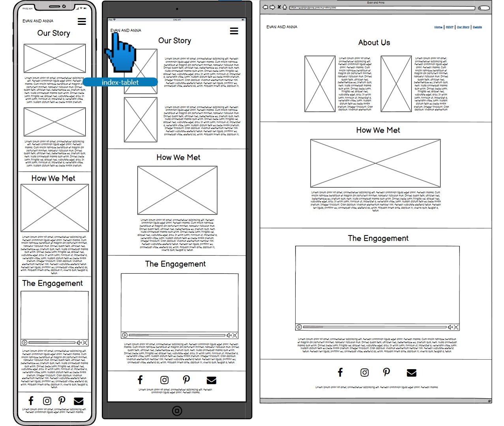
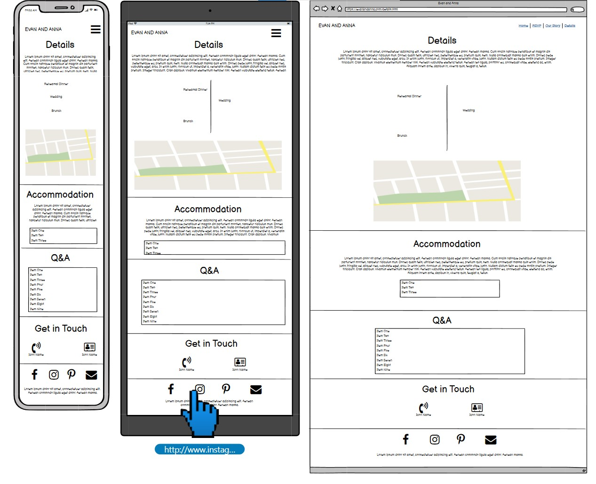
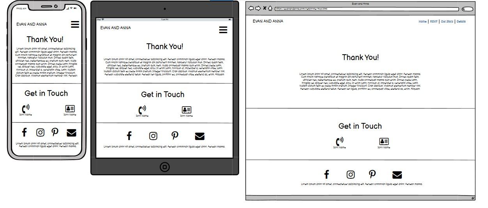
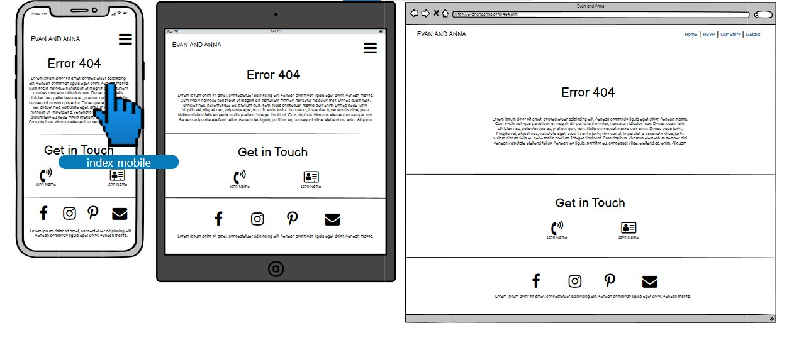

# Build a Wedding RSVP website

This website has been created as a first portfolio for the Code Institute's Full Stack Software Development Course. Evan and Anna's website is a fictional website. 

Visit the live [website](https://aoifesmith.github.io/evanandanna/). 

## Table of Contents
  * [UX and UI](#ux-and-ui)
    * [External User Goals](#external-user-goals)
    * [Owner Goals](#site-owner-goals)
    * [Potential features to include:](#potential-features-to-include)
    * [User Stories](#user-stories)
    * [Wireframes](#wireframes)

## UX and UI

### External User Goals:
The site users have been invited to a wedding and want to RSVP attendance for couples numbers as well as find out details about the wedding day. 

### Site Owner Goals:
The goal of the site is for site owners to:
  * Confirm guest attendance and food choice in advance of their wedding to save food costs.
  * Provide the couples story
  * Provide information about local amenities. 
  * Request guests to get involved in the documenting of their memories by tagging to the couples social profiles to create a digital album of their journey.

### Potential features to include:
  * A timeline of events/locations
  * Couples story information
  * Images/video supporting the couples engagement & story
  * Form to submit attendance and food choice details
  * Contact and social information links to follow and share in couples journey.

### User Stories:

 1. As a first time user, I want to intuitively navigate the site.
 2. As a wedding guest, I want to respond to the couple's wedding invitation so that they can advise the venue of meal/seating numbers.
 3. As a guest accepting the couple's wedding invitation, I'd like to learn about the event dates and times so that I may there on time.
 4. As a guest attending the couple's wedding invitation, I'd like to learn the location specifics so that I may arrive at the correct venue.
 5. As the wedding couple, we want to present guests with information we've gathered on area lodging and amenities so they don't have to waste time looking up information we've already found.
 6. As the wedding couple, we'd like to compile meal preferences from confirmed guests to submit to the venue chef in order to save money on meals.
 7. As the wedding couple, we want to introduce ourselves to any guests who are unfamiliar with our partners so that they can learn more about us and ‘break the ice' with topics of interest to discuss.
 8. As the wedding couple, we want to provide social media links for guests to follow our journey through images and tag us in photos and memories taken along the way providing a hashtag.
 9. As a user, I want to get in touch with the site owner.

   
### Wireframes:
   Wireframes were originally hand sketched designs created to aid planning the website layout. These were then created using [balsamic](https://balsamiq.com/). These include link references to other pages such as RSVP button on home page to the RSVP form page, navigation menu links etc. for user design clarity and quick navigation. 
    * Mobile, Tablet, and Desktop wireframes are all available [here](docs/wireframes/evanandanna-wireframes.pdf)
 

 
   
    
    
      

